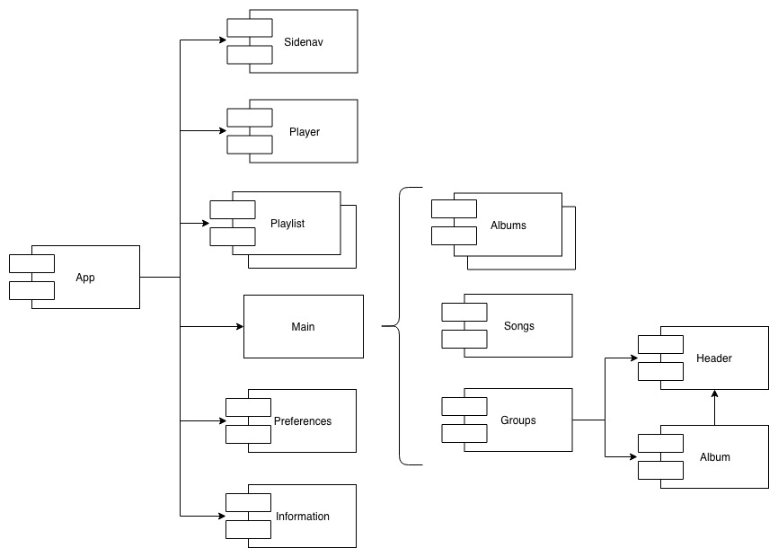

# **Bolt**

## Introduction

All that you would expect of a music player, is here.

## Functional description

With Bolt you can easily play your songs. Its user friendly design helps in jumping between songs, playing artists, randomizing all your songs and more!

### Use cases

## Technical description

Bolt is a cross-platform desktop app build with Electron, ReactJS and Lilli.

### Technology stack

* HTML5
* JavaScript ES6
* Node.js
* Webpack
* Babel
* SASS
* Electron
* ReactJS
* Lilli
* Jest
* Nucleus

### Block diagram

### Component diagram

### Data model diagram

